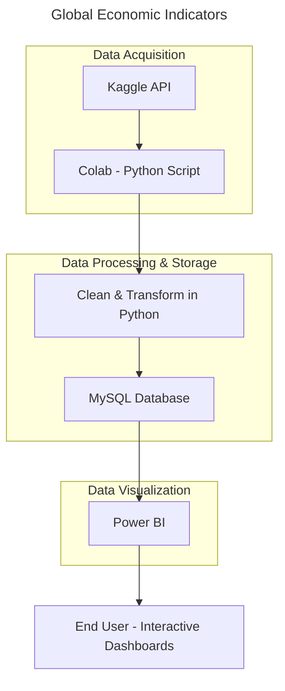

# End-to-End Data Pipeline: Global Economic Indicators

## Data Acquisition, Cleaning, SQL Upload, and Analysis with Python and MySQL

This project demonstrates a complete end-to-end data pipeline built to analyze global economic trends across more than 200 countries over a 15-year period (2010–2025). Using Python in Google Colab, I accessed a Kaggle dataset through the Kaggle API, performed thorough data cleaning (including handling missing values), and uploaded the processed data into a MySQL database. From there, I conducted structured queries to explore economic indicators such as inflation, interest rates, GDP, and more.

---

## Project Overview

---

## Project Steps:

### 1- Set Up the Environment:
* Tools Used: Google Colab, Python, SQL (MySQL), Power BI.

### 2- Set Up Kaggle API:
* **API Setup**: Obtain your Kaggle API token from Kaggle by navigating to your profile settings and downloading the JSON file.
* **from google colab**:
    * run this code: from google.colab import files, files.upload()
    * upload the JSON file into files (google.colab)
 * **Set up the directory using**:
     * !mkdir -p ~/.kaggle
     * !cp kaggle.json ~/.kaggle/
     * !chmod 600 ~/.kaggle/kaggle.json
  
### 3- Download the Dataset:
* **Dataset Link**: https://www.kaggle.com/datasets/tanishksharma9905/global-economic-indicators-20102025
* **Run this code in Colab**: !kaggle datasets download -d tanishksharma9905/global-economic-indicators-20102025
* **Unzip the Dataset**: ! unzip /content/global-economic-indicators-20102025.zip

### 4- Import Required Libraries:
* Pandas, Numpy, kagglehub, pymysql, sqlalchemy
* If you didn't install these libraries before, use pip install (library name) to install it.

### 5- Load Data:
* using read_csv function from pandas.

### 6- Explore the Data:
* **Goal**: Conduct an initial data exploration to understand data distribution, check column names, types, and identify potential issues.
* **Analysis**: Use functions like .info(), .describe(), .sample(), etc. to get a quick overview of the data structure and statistics.

### 7- Data Cleaning:
* **Handle Missing Values**: Using Global values to fill the missing values.

### 8- Load Data into MySQL:
* **Create Database in MySQL**: before uploading the dataset into MySQL, we did Create Database in the MySQL.
* **Set Up Connections**: Connect to MySQL using sqlalchemy and load the cleaned data into the database.

### 9- SQL Analysis:
* **Write Questions to Solve using MySQL**: writing questions for each aspect with the interpretations.
* **Solve the Questions**: solving the nine questions using Mysql.
* **Download the answers**: downloading the csv file of each answer into the local device.

### 10- Power BI Visualization:
* **Unpload the Answers into Power BI app**: use the app to visualize the results into charts
___

## Requirments
* **Python 3.8+**
* **SQL Databases**: MySQL
* **Python Libraries:**
    * pandas, numpy, sqlalchemy, mysql-connector-python, psycopg2
* **Kaggle API Key** (for data downloading)

---

## Project Structure
* **data:** Raw data and transformed data
* **sql_queries:** SQL scripts for analysis and queries
* **notebooks:** Google Colab for Python analysis
* **README.md:** Project documentation
* **main.py:** Main script for loading, cleaning, and processing data

---

## Results and Insights
* soon

---

## Future Enhancements
* **Analyze all indicators:** analysing all the indicators will give the full picture and insight information
* **Find the best and worst countries economically during the past 15 years**

---

## License
This project is licensed under the MIT License.

---

## Acknowledgments
* Data Source: Kaggle’s Global Economic Indicators (2010–2025)- World bank

