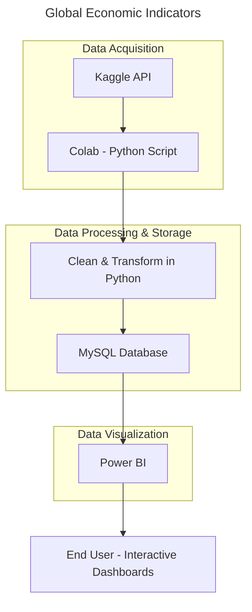

# End-to-End Data Pipeline: Global Economic Indicators

## Data Acquisition, Cleaning, SQL Upload, and Analysis with Python and MySQL

This project demonstrates a complete end-to-end data pipeline built to analyze global economic trends across more than 200 countries over a 15-year period (2010–2025). Using Python in Google Colab, I accessed a Kaggle dataset through the Kaggle API, performed thorough data cleaning (including handling missing values), and uploaded the processed data into a MySQL database. From there, I conducted structured queries to explore economic indicators such as inflation, interest rates, GDP, and more.

## Project Overview

## Project Steps:

### 1- Set Up the Environment:
* Tools Used: Google Colab, Python, SQL (MySQL), Power BI

### 2- Set Up Kaggle API:
* **API Setup**: Obtain your Kaggle API token from Kaggle by navigating to your profile settings and downloading the JSON file.
* **from google colab**:
    * run thiss code: from google.colab import files, files.upload()
    * upload the JSON file into files (google.colab)
 * **Set up the directory using**:
     * !mkdir -p ~/.kaggle
     * !cp kaggle.json ~/.kaggle/
     * !chmod 600 ~/.kaggle/kaggle.json
  
### 3- Download the Dataset:
* **Data Source**: Use the Kaggle API to download the dataset from Kaggle
* **Dataset Link**: https://www.kaggle.com/datasets/tanishksharma9905/global-economic-indicators-20102025

